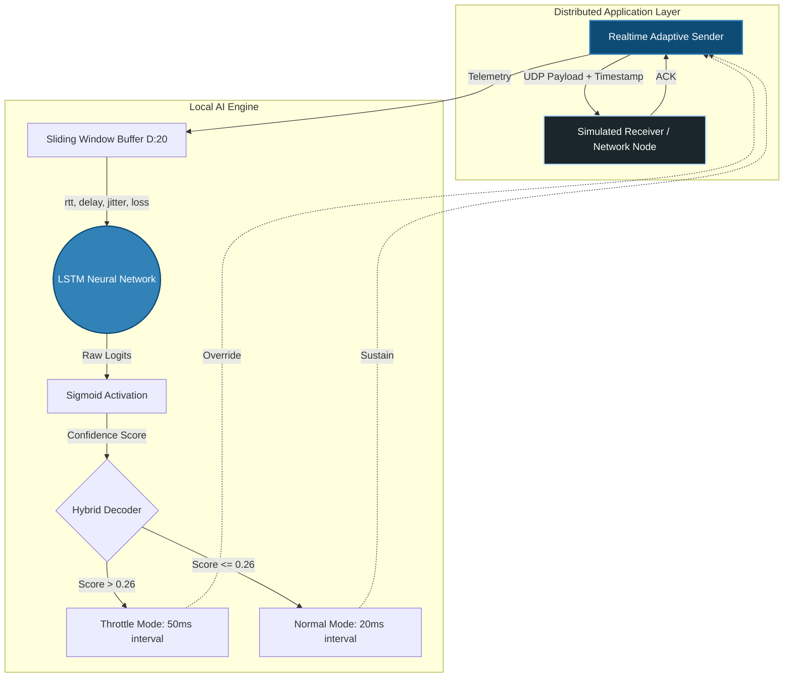

# 📡 UDP Network Jitter Prediction & AI-Driven Traffic Shaping


Welcome to the **UDP Jitter Prediction** repository. This project represents a novel approach to network reliability: an autonomous, AI-driven UDP client-server architecture that natively learns network behavior, forecasts degradation (jitter spikes) before they hit, and dynamically shapes its own traffic to preserve stability.

---

## 🎯 The Problem: Reactive vs. Proactive Networking

In real-time UDP applications (e.g., VoIP, competitive gaming, live video broadcasting), **jitter** (the variation in packet delay) and **packet loss** are the primary enemies of user experience. 

Traditional networking protocols (like TCP congestion control or standard UDP pacing) are inherently **reactive**. They wait for packets to drop or buffers to bloat before they slow down. By the time the system reacts, the user has already experienced lag, robotic audio, or visual artifacting.

### 💡 The Solution

This system is **proactive**. By continuously feeding a sliding window of network telemetry (RTT, inter-arrival delay, jitter, and loss) into a trained **Long Short-Term Memory (LSTM)** neural network, the system detects the subtle precursors of network congestion. It forecasts spikes in the near future and preemptively reduces its transmission rate, mitigating the severity of the bottleneck before it overwhelms the pipeline.

---

## 🏗️ System Architecture

The project is split into two halves: the data pipeline/training environment, and the real-time adaptive engine.

### Real-Time Inference Node & Agent


---

## ✨ Features & Capabilities

- **Stochastic Environment Simulator (`receiver.py`)**: A UDP server that intentionally degrades connection quality. It models 5-7% baseline packet loss and probabilistic "Burst Spike Episodes" where latency skyrockets and jitter swings wildly.
- **Micro-Telemetry Engine (`sender.py`)**: Tracks microsecond-level discrepancies in packet inter-arrival times, converting timestamps into rich features (RTT, absolute delay, differential jitter).
- **Time-Series Deep Learning (`model.py`)**: A PyTorch LSTM designed specifically for sequenced telemetry. It operates on a 20-packet sliding window.
- **Dynamic Preprocessing (`preprocess.py`)**: Normalizes erratic millisecond data, fills temporal gaps left by dropped packets, and dynamically labels "spikes" using standard-deviation bounding.
- **Imbalance-Aware Training (`train.py`)**: Real network spikes are rare (often < 5% of packets). The training loop uses `BCEWithLogitsLoss(pos_weight=...)` alongside dynamic `ReduceLROnPlateau` scheduling to penalize missed spikes heavily, achieving ~1.0 Recall.
- **Hybrid Thresholding (`realtime_sender.py`)**: Combines the LSTM's probabilistic foresight with a hard rule-based heuristic (latest jitter metrics normalized). This prevents complete reliance on black-box ML during unprecedented extreme spikes (e.g. 1000ms+ delays).

---

## 🧬 Component Deep Dive

### 1. Network Telemetry & Parsing (`preprocess.py`)
To train the model, we require structural examples of network failures. 
- **Windowing**: The data is chopped into overlapping windows of size `W=20`. 
- **Horizon Forecasting**: For each window, the script looks ahead into the next `H=15` packets. 
- **Dynamic Thresholds**: If the `max(future_jitter)` > `mean(current_window) + 0.5 * std(current_window)`, the window is labeled as `1` (Spike Incoming).

### 2. The Neural Architecture (`model.py`)
Because network conditions rely heavily on temporal context, an LSTM handles the inference.
- **Input Shape**: `(Batch, Seq_Len=20, Features=4)`
- **Encoder**: 2 Stacked LSTM layers with 64 hidden units and `Dropout=0.3`.
- **Head**: The sequence is flattened at the final timestep and passed into a fully-connected layered block (64 $\rightarrow$ 32 $\rightarrow$ 1) to output a single logit.

### 3. The Real-Time Agent (`realtime_sender.py`)
Instead of offline processing, the sender utilizes two internal threads:
- **Networking Thread**: Blindly fires UDP packets at whatever `interval_ref` mandates.
- **Inference Thread**: Unpacks returning ACKs, measures the time differentials, pushes new data into a `collections.deque` buffer, standardizes it, executes `predict_spike(window)`, and instantly mutates the networking thread's `interval_ref` pacing.

---

## 🚀 Installation & Usage

### Prerequisites
Requires Python 3.10 or higher.
```bash
pip install torch pandas numpy matplotlib
```

### Phase 1: Data Synthesis
Start the receiver to begin simulating the chaotic network link.
```bash
python receiver.py
```
In a new terminal, run the raw sender to pound the receiver with packets. Let this run for a few minutes.
```bash
python sender.py
```
*Result: `sender_log.csv` is populated with raw telemetry.*

### Phase 2: AI Training Pipeline
Compile the dataset into ML sequences and spawn the training loop.
```bash
# Slices logging data into X (sequences) and Y (labels)
python preprocess.py

# Trains the LSTM. Will save best model to model.pth
python train.py
```

### Phase 3: Autonomous Real-Time Shaping
With the receiver still running in the background, deploy the intelligent sender:
```bash
python realtime_sender.py
```
**Expected Output:**
```text
[seq= 1024] RTT= 42.1ms delay= 20.3ms jitter= 0.3ms
  Predicted probability: 0.1142
  Hybrid score: 0.0820 (jitter_norm=0.04)
  OK Normal network (interval=20ms)

[seq= 1025] RTT= 185.3ms delay= 120.4ms jitter= 100.1ms
  Predicted probability: 0.6512
  Hybrid score: 0.6575 (jitter_norm=0.66)
  WARNING Spike predicted -> slowing down (interval=50ms)
```

### Phase 4: Analytics
Stop the sender and visualize exactly what happened and *why* the AI made its decisions.
```bash
python plot_graphs.py
```

---

## 📈 Example Visualizations

When you run `plot_graphs.py`, the system generates four critical views of your session:
1. **RTT Over Time**: See the total physical latency experienced by the link.
2. **Jitter Volatility**: Maps the first derivative of delay, isolating structural instability.
3. **Probability Matrix**: Tracks the raw confidence output of the LSTM sigmoid function.
4. **Agent Decisions**: The binary step-function showing exactly when the system chose to throttle the connection pacing.

---
*Created as part of an advanced networking & AI exploration into self-healing architectures.*
